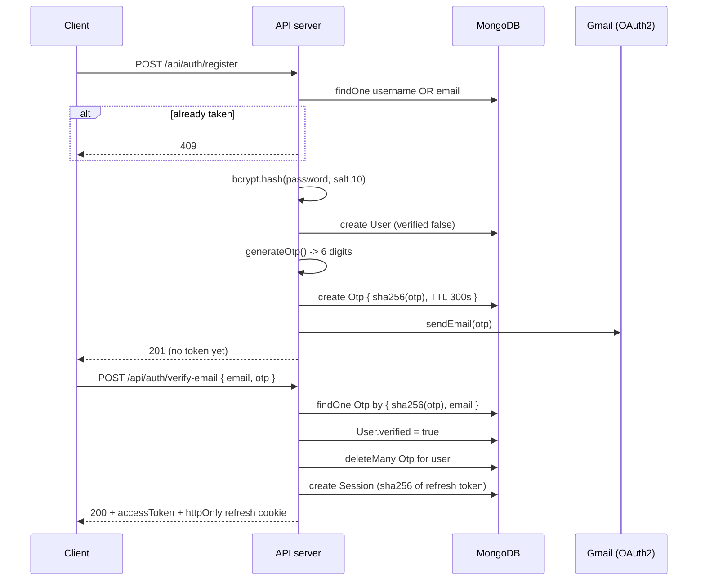
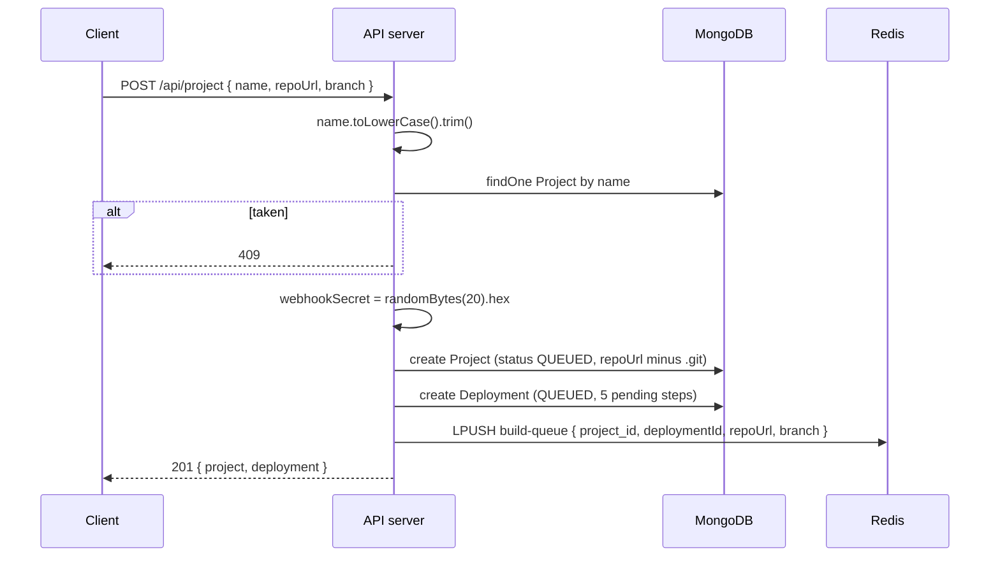
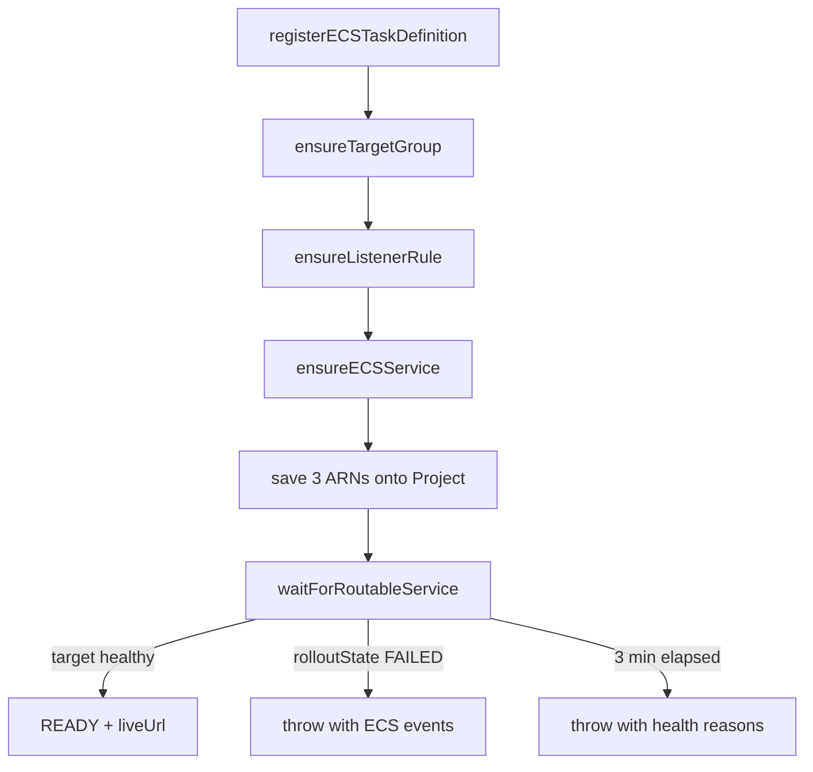
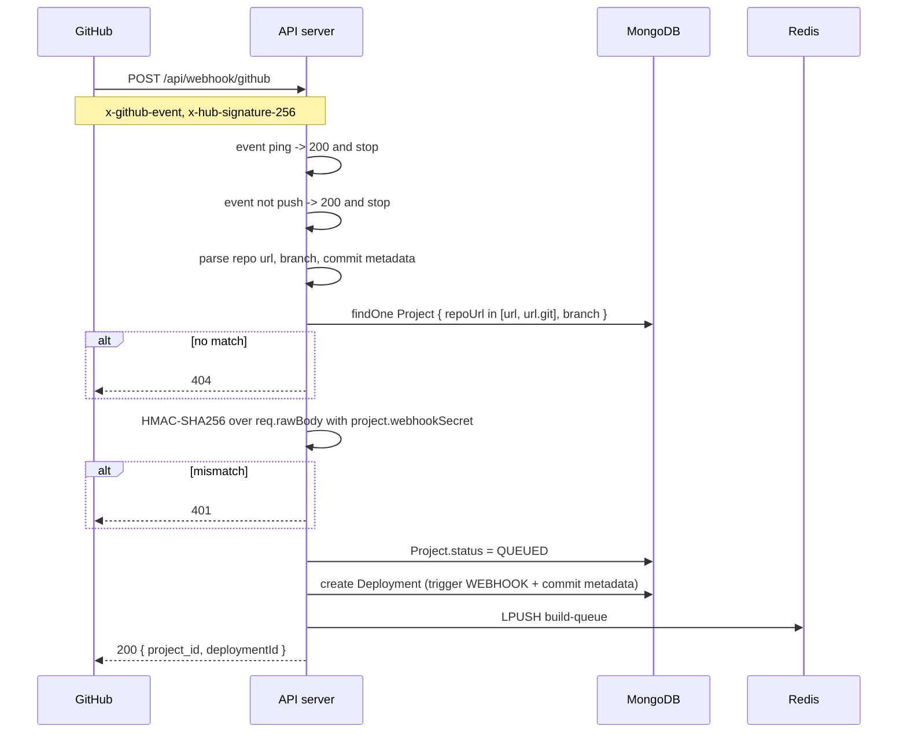
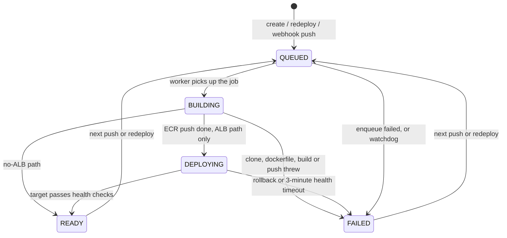

# LaunchBase — Backend Architecture & Data Flow

> Derived by reading the source, not the roadmap. Every constant, route, schema
> field and AWS parameter below was verified against the files in `backend/src`.
> Where the code and its own comments disagree, that is recorded in §15.

---

## 1. The one-paragraph version

LaunchBase takes a GitHub repository URL and returns a running container behind a
URL. A user creates a project through a REST API; that writes a `Deployment`
record and pushes a job onto a Redis list. A **separate OS process**, the build
worker, blocks on that list, clones the repo, generates a Dockerfile if the repo
has none, builds an image, pushes it to AWS ECR, registers an ECS task
definition, and then either starts a supervised ECS service behind an
Application Load Balancer or fires a one-shot Fargate task. Everything the worker
prints is published to a Redis pub/sub channel, relayed by the API server over
Socket.IO into a per-project room, and simultaneously batched into MongoDB so a
page refresh can replay the build.

---

## 2. Topology

Two Node processes. Neither imports the other.

| Process | Started by | Entry | Owns |
|---|---|---|---|
| **API server** | `npm run dev` / `npm start` | `server.js` → `src/app.js` | REST, JWT auth, Socket.IO, the Redis **subscriber** |
| **Build worker** | `npm run worker` | `src/workers/buildWorker.js` | the queue consumer, Docker, AWS, the Redis **publisher** |

They communicate only through shared infrastructure.

```
        ┌──────────────────────────┐         ┌──────────────────────────┐
        │      API SERVER          │         │      BUILD WORKER        │
        │  server.js (:8000)       │         │  buildWorker.js          │
        │  Express + Socket.IO     │         │  while(true) BRPOP       │
        └────┬───────────┬─────────┘         └────┬──────────┬──────────┘
             │           │                        │          │
   reads/writes      SUBSCRIBE               PUBLISH     reads/writes
             │     deployment:events              │          │
             │           │                        │          │
             ▼           ▼                        ▼          ▼
        ┌─────────┐  ┌──────────────────────────────┐  ┌──────────┐
        │ MongoDB │  │            REDIS             │  │ MongoDB  │
        │         │  │  list  "build-queue"         │  │          │
        │ users   │  │  chan  "deployment:events"   │  │ same DB  │
        │ projects│  └──────────────────────────────┘  └──────────┘
        │ deploys │
        │ sessions│                    worker also drives:
        │ otps    │            Docker CLI · AWS ECR · ECS · ELBv2 · git
        └─────────┘
```

**Why two processes.** A `docker build` can take minutes and saturate a core. In
the API process it would block the event loop and stall every other request. The
cost of splitting them is that the worker has no access to the Socket.IO server,
which is exactly the problem §9 solves.

### External systems

| System | Reached by | Used for |
|---|---|---|
| MongoDB | `mongoose` | users, projects, deployments, sessions, OTPs |
| Redis | `ioredis` | job queue (list) and event bus (pub/sub) |
| Docker Engine | `child_process.spawn("docker", …)` | build, tag, login, push |
| AWS ECR | `@aws-sdk/client-ecr` | auth token, repository creation |
| AWS ECS | `@aws-sdk/client-ecs` | task definitions, tasks, services |
| AWS ELBv2 | `@aws-sdk/client-elastic-load-balancing-v2` | target groups, listener rules, target health |
| GitHub | inbound webhook | push events |
| Gmail | `nodemailer` + `googleapis` OAuth2 | OTP delivery |

The Docker CLI is shelled out to rather than driven through a Docker SDK. That is
what makes streaming build output straightforward: `spawn` hands back raw stdout
and stderr chunks that go directly into the logger.

---

## 3. The API server

### 3.1 Middleware order (`src/app.js`)

Order is load-bearing in two places.

1. **`cors({ origin: FRONTEND_URL, credentials: true })`** — first, so a preflight
   `OPTIONS` short-circuits before any body parsing runs. `credentials: true` is
   what allows the httpOnly refresh cookie to travel cross-origin.
2. **`express.json({ verify })`** — the `verify` hook stashes the untouched request
   bytes on `req.rawBody`. GitHub signs those exact bytes, so the webhook cannot
   verify against a re-serialized object.
3. `morgan('dev')`
4. `cookieParser()`

Then four routers, then `GET /` as a liveness probe.

### 3.2 Complete route inventory

Auth (`/api/auth`) — only `/me` sits behind the JWT middleware:

| Method | Path | Guard | Behavior |
|---|---|---|---|
| POST | `/register` | — | 409 on duplicate username or email, else creates user and emails an OTP |
| POST | `/login` | — | 401 if unverified or bad credentials, else session + tokens |
| POST | `/verify-email` | — | consumes the OTP, marks verified, **returns an access token** |
| GET | `/me` | JWT | current user |
| POST | `/refresh` | refresh cookie | rotates the refresh token, issues a new access token |
| POST | `/logout` | refresh cookie | revokes one session |
| POST | `/logout-all` | refresh cookie | revokes every session for the user |

Projects (`/api/project`) — all behind the JWT middleware:

| Method | Path | Behavior |
|---|---|---|
| POST | `/` | create project, immediately create a MANUAL deployment and enqueue it |
| GET | `/` | the user's projects, each with `latestDeployment` attached |
| GET | `/:project_id` | one project with `latestDeployment` |
| DELETE | `/:project_id` | AWS teardown, then delete the project and cascade its deployments |
| GET | `/:project_id/deployments` | last 30, logs excluded |
| POST | `/:project_id/redeploy` | 409 if a build is already in flight |

Deployments (`/api/deployment`), JWT-guarded:

| Method | Path | Behavior |
|---|---|---|
| GET | `/:deployment_id` | one deployment **including full logs**, project populated |

Webhook (`/api/webhook`) — deliberately unguarded, authenticated by HMAC instead:

| Method | Path | Behavior |
|---|---|---|
| POST | `/github` | ping and non-push events return 200 and stop |

Every project and deployment query filters on the caller's id. There is no
separate authorization layer, so an unowned id returns **404, not 403** — the API
never confirms that someone else's resource exists.

### 3.3 Auth mechanics

Two tokens, both signed with `JWT_SECRET`, distinguished only by lifetime and
transport.

| | Access token | Refresh token |
|---|---|---|
| Lifetime | 15 minutes | 7 days |
| Carried in | `Authorization: Bearer` | httpOnly cookie `refreshToken` |
| Payload | `{ id, sessionId }` | `{ id }` |
| Stored server-side | no | SHA-256 hash on a `Session` document |

The refresh token is **rotated on every use**. `/refresh` verifies the JWT, looks
the session up by hash, then writes a *new* hash onto that same session document
and re-issues the cookie. A stolen refresh token therefore has a short useful
life, because the next legitimate refresh invalidates it.

Cookie flags come from a single helper, `refreshCookieOptions()` in
`src/utils/util.js`. `secure` is gated on `NODE_ENV === 'production'` because
Safari silently drops Secure cookies over `http://localhost`, which breaks
refresh in local dev in a way that produces no error message.

The JWT middleware (`src/middlewares/auth.middleware.js`) does a database lookup
on every guarded request and attaches the full Mongoose user document as
`req.user`. That is one extra round trip per request, and it is what lets a
deleted or modified user take effect immediately rather than at token expiry.

Email verification uses a **hashed** OTP. `handleRegister` generates six digits
with `crypto.randomInt`, stores only `sha256(otp)`, and mails the plaintext. The
`Otp` document carries `expires: 300` on `createdAt`, so MongoDB's TTL monitor
deletes it about five minutes later with no application code involved.
Verification hashes the submitted code and looks it up by hash and email.

---

## 4. Data model

Five collections. The important structural decision is that **`Project` holds
current state and `Deployment` holds history**.

### `User` — `models/user.model.js`

```
username        String  required, unique, trimmed, min 3
email           String  required, unique, lowercased, trimmed
password        String  required, min 8, select: false
verified        Boolean default false
githubUsername  String  default null
+ timestamps
```

`select: false` on `password` means it is excluded from every query unless
explicitly asked for. `handleLogin` is the only place that opts back in, with
`.select("+password")`.

### `Project` — `models/project.js`

```
name               String   required, UNIQUE, lowercase, /^[a-z0-9-]+$/
owner              ObjectId ref User, indexed
repoUrl            String   required, stored WITHOUT a trailing .git
branch             String   default "main"
webhookSecret      String   required, crypto.randomBytes(20).toString("hex")
status             enum     IDLE|QUEUED|BUILDING|DEPLOYING|READY|FAILED
ecrImageUri        String   default null
ecsServiceArn      String   default null   (actually holds the service NAME)
albTargetGroupArn  String   default null
albListenerRuleArn String   default null
liveUrl            String   default null
+ timestamps
```

Two consequences of that `name` field are worth understanding:

- The regex is not cosmetic. `name` becomes the DNS label in
  `<name>.<PLATFORM_DOMAIN>`, so it must already be a valid hostname component.
- `unique: true` is **global, not per-owner**. Two different users cannot both own
  a project called `blog`. That follows directly from subdomains being a global
  namespace, and `handleCreateProject` pre-checks it to return a clean 409 rather
  than a raw Mongo duplicate-key error.

The two ALB ARN fields exist purely so deletion can tear down what a build
created. A listener accepts at most 100 rules, so a leaked rule permanently
consumes one of those slots.

### `Deployment` — `models/deployment.model.js`

```
project        ObjectId ref Project, indexed
owner          ObjectId ref User, indexed        <- denormalized on purpose
status         enum QUEUED|BUILDING|DEPLOYING|READY|FAILED
trigger        enum MANUAL|WEBHOOK
commitHash     String   null unless WEBHOOK
commitMessage  String
author         String
steps          [ { name, status, startedAt, finishedAt } ]   _id: false
logs           [ { ts, line, stream } ]                      _id: false
ecrImageUri    String
taskArn        String
liveUrl        String
errorMessage   String
startedAt      Date
finishedAt     Date
+ timestamps
+ compound index { project: 1, createdAt: -1 }
```

Constants exported alongside the model: `BUILD_STEPS = [CLONE, DOCKERFILE, BUILD,
PUSH, DEPLOY]` and `MAX_LOG_LINES = 2000`.

`steps` is pre-populated by a schema default, so a deployment carries all five
rows in `pending` from the moment it is created. The UI can therefore render the
full stepper before the worker has even picked the job up.

`owner` is duplicated from the project so that both the REST ownership check and
the Socket.IO room check are a single indexed query with no `populate`.

Step status has five values, not three: `pending`, `running`, `success`,
`failed`, `skipped`.

### `Session` — `models/session.model.js`

```
user             ObjectId ref User, indexed
refreshTokenHash String   sha256 hex
ip               String
userAgent        String
revoked          Boolean  default false
+ timestamps
```

Only the hash is stored, so a database leak does not hand over usable refresh
tokens.

### `Otp` — `models/otp.model.js`

```
email      String   lowercased
user       ObjectId ref User
otpHash    String   sha256 hex
createdAt  Date     expires: 300   <- MongoDB TTL index
+ timestamps
```

---

## 5. Flow A — signup to authenticated session



Registration returns **no token**. Login rejects an unverified user with 401. The
only door into an authenticated state for a new account is verifying the email,
which is why `handleVerifyEmail` creates a session and returns an access token
directly. Without that, a user would verify and then be bounced to a login form.

---

## 6. Flow B — create a project



Three details:

- `repoUrl` has any trailing `.git` stripped **at write time**, so webhook lookups
  later have one canonical form to match against.
- The project is created with `status: "QUEUED"`, never `IDLE`. `IDLE` is the
  schema default but the create path skips it, because a project always builds
  the moment it is created.
- If enqueueing throws, `createDeployment` marks the deployment `FAILED` and
  rethrows, and the controller then marks the project `FAILED`. Nothing is left
  sitting in `QUEUED` waiting for a job that was never posted.

The response includes the deployment so the client can navigate straight into a
live build view without a second request.

---

## 7. Flow C — the build pipeline

`createDeployment` in `services/deployment.service.js` is the single shared entry
point for both the manual route and the webhook. Both therefore produce
byte-identical deployment records apart from `trigger` and commit metadata.

### 7.1 Queue mechanics

```
API                 Redis list "build-queue"                 Worker
 │                                                             │
 ├─ LPUSH ──────────▶ [ job ]                                   │
 │                        │◀─────────────── BRPOP (timeout 0) ──┤ blocks
 │                                                              │
```

`services/queue.service.js` is 34 lines and does exactly two things. `BRPOP` with
a timeout of `0` blocks indefinitely, so the worker consumes no CPU while idle and
there is no polling interval to tune. Combined with `LPUSH` at the head and
`BRPOP` at the tail, the list behaves as FIFO.

The worker is a single `while (true)` loop processing **one job at a time,
globally** — not one per project. This is the reason `redeploy` returns 409 on a
concurrent build: two jobs for the same project would race on the same workspace
directory.

### 7.2 The five steps

Workspace: `backend/workspace/<project_id>`, wiped before and after every job.

| # | Step | Implementation | What actually happens |
|---|---|---|---|
| 1 | `CLONE` | `simple-git` | `rm -rf` then `mkdir` the workspace, then `git clone --branch <branch> --depth 1` |
| 2 | `DOCKERFILE` | `docker.service.js` | if a Dockerfile exists, leave it alone; otherwise detect the runtime and write one |
| 3 | `BUILD` | `docker.service.js` | `docker build --platform=linux/amd64 --progress=plain -t launchbase-<id>:latest <dir>`, 10-minute timeout |
| 4 | `PUSH` | `ecr.service.js` | ECR auth token, `docker login --password-stdin`, ensure repo, `docker tag`, `docker push` |
| 5 | `DEPLOY` | `ecs.service.js` + `alb.service.js` | register a task definition, then branch on `ALB_ENABLED` |

`currentStep` is tracked in a plain variable through the whole `try` block, so a
throw anywhere marks exactly the right step `failed` before the deployment goes
`FAILED`.

### 7.3 Dockerfile generation

Detection is a fixed precedence chain, first match wins:

| Probe file | Base image | Start command |
|---|---|---|
| `Dockerfile` | — | left untouched, generation skipped entirely |
| `package.json` | `node:18-alpine` | `npm start` if a start script exists, else `node <main or index.js>` |
| `requirements.txt` | `python:3.12-slim` | `python <detected entry>`, or `manage.py runserver 0.0.0.0:8080` for Django |
| `go.mod` | `golang:1.20-alpine` → `alpine` | `./main`, multi-stage with `CGO_ENABLED=0` |
| none of the above | — | throws, and the build fails at step 2 |

Node projects additionally get `RUN npm run build` when a build script exists, and
always `RUN npm prune --production`.

Python entry-point detection is the only heuristic here. If exactly one `.py` file
exists it wins. Otherwise every `.py` file is read looking for a
`if __name__ == "__main__"` block, a `.run(`, `uvicorn`, `Flask(__name__)` or
`FastAPI()`. Failing all of that it falls back to `main.py`.

Every generated Dockerfile ends with `ENV PORT=8080` and `EXPOSE 8080`, because
8080 is hardcoded as `CONTAINER_PORT` in the ALB service and referenced by the ECS
task definition. That number is the contract between three files.

Three deliberate choices in `buildDockerImage`:

- `--platform=linux/amd64` is not optional on an Apple Silicon machine. Fargate
  runs x86, and an arm64 image would push successfully and then fail to start.
- `--progress=plain` forces line-based output. BuildKit's default emits TTY redraw
  sequences that capture badly into a log record.
- `docker build` writes progress to **stderr** under normal operation, so the
  worker labels that stream `stdout` anyway rather than painting a healthy build
  red.

### 7.4 ECR push

`getEcrLoginToken` returns a base64 `user:password` blob that is split on `:`. The
password is piped to `docker login --password-stdin`, never passed as an argument,
so it cannot appear in the process list.

That login command is the one Docker invocation called **without** an `onLog`
sink. It prints a credential-storage warning that has no business in a
user-visible build log.

`ensureEcrRepository` uses catch-as-control-flow: it describes the repository and
treats `RepositoryNotFoundException` as "create it". The repository name is
`launchbase-<project_id>` and the pushed tag is always `latest`.

---

## 8. Flow D — the two deploy paths

The task definition is identical in both cases:

```
family        vercel-clone-task-<project_id>
networkMode   awsvpc          requiresCompatibilities  [FARGATE]
cpu           256             memory                   512
container     "user-app-container"  port 8080/tcp
logs          awslogs -> /ecs/vercel-clone, stream prefix "ecs"
```

The container name is not arbitrary. `CreateService` names a container/port pair
in its `loadBalancers` block, and it must match the task definition exactly or ECS
rejects the service with an opaque validation error.

### 8.1 `ALB_ENABLED = false`

```
registerECSTaskDefinition() -> runECSTask() -> READY, liveUrl stays null
```

A one-shot `RunTask` with `assignPublicIp: ENABLED`. Nothing supervises it,
nothing restarts it, and its public IP changes on every deploy. `taskArn` is
recorded and the UI renders "URL pending".

This path is not a degraded mode waiting to be fixed. An ALB bills roughly
$16/month from the moment it exists, so working without one has to stay a
first-class path.

### 8.2 `ALB_ENABLED = true`



The routing shape, per project:

```
              browser
                 │  Host: blog.example.xyz
                 ▼
        ┌──────────────────────┐
        │  ONE shared ALB      │
        │  listener :80        │
        └──────────┬───────────┘
     prio 10 ──────┼────── prio 11 ────── default
   Host=blog.…     │     Host=shop.…       → 404
        ▼          │          ▼
  ┌───────────┐    │    ┌───────────┐
  │target grp │    │    │target grp │   TargetType: ip
  │ :8080     │    │    │ :8080     │   health / every 15s
  └─────┬─────┘    │    └─────┬─────┘
        ▼          │          ▼
  10.0.1.55:8080   │    10.0.2.31:8080   ← private task IPs,
  (ECS service)    │    (ECS service)      registered by ECS itself
```

**Target group** (`ensureTargetGroup`), created once per project and reused:

| Setting | Value | Why |
|---|---|---|
| Name | `lb-<up to 20 chars>-<8 hex of sha1(id)>` | 32-char AWS cap; the id hash prevents collisions between truncated names and stays stable across redeploys |
| TargetType | `ip` | Fargate tasks get their own network interface, so there is no instance to register |
| Health path, interval, threshold | `/`, 15s, 2 checks | tighter than the AWS default of 30s and 5 checks, so a demo goes live in about 30s instead of 2.5 minutes |
| Matcher | `200-399` | many apps answer `/` with a 302 to `/login`; a strict 200 would mark those unhealthy forever |
| `deregistration_delay` | 5s | the AWS default of 300s would make project deletion appear to hang for five minutes |

That last attribute cannot be set during creation, hence the separate
`ModifyTargetGroupAttributes` call immediately after.

**Listener rule** (`ensureListenerRule`) matches on the host header. Priorities 1
through 9 are reserved for future platform-level rules; project rules start at 10.
`findFreePriority` scans existing rules and takes the lowest unused number, so gaps
left by deleted projects are reused rather than marching toward the 100-rule
ceiling.

The rule function has a third branch that is easy to miss and matters most: if a
rule for the host already exists but forwards to a *different* target group, it is
repointed with `ModifyRule`. Without that, recreating a target group would leave
the old rule holding a dead ARN and every request would 503.

**ECS service** (`ensureECSService`) is idempotent. `describeECSService` treats
`INACTIVE` as absent, since ECS keeps deleted services queryable for a while and a
redeploy after a delete must create cleanly rather than update a corpse. A
`DRAINING` service raises a clear "retry in a minute" error instead of an AWS one.

| Setting | Value | Effect |
|---|---|---|
| `minimumHealthyPercent` / `maximumPercent` | 100 / 200 | the old task keeps serving until the new one is healthy: zero downtime, at the cost of a second task for about a minute |
| `healthCheckGracePeriodSeconds` | 60 | without it a slow-booting app is marked unhealthy, killed, and crash-loops forever |
| `deploymentCircuitBreaker` | enable + rollback | a broken deploy gives up and restores the previous version instead of retrying indefinitely |
| `forceNewDeployment` on update | true | forces a re-pull of the `:latest` tag even when the task definition ARN is unchanged |

**Why a service instead of a task.** A service registers the task's private IP into
the target group on start and deregisters it on stop, automatically. Doing that by
hand would break the first time a task restarted with a new IP.

### 8.3 The health wait

`waitForRoutableService` polls every 10 seconds for up to 3 minutes, calling
`describeECSService` and `getTargetHealth` in parallel.

The distinction it enforces is the whole point. **"ECS started the task" and "the
app is reachable" are different claims**, and only the second justifies `READY`. A
container that boots but never binds its port looks perfectly healthy to ECS while
the ALB serves 503.

Three exits:

- **A healthy target** — logs the count and returns.
- **`rolloutState === "FAILED"`** — the circuit breaker already rolled back, so
  waiting out the remaining timeout would learn nothing. The last five ECS events
  are dumped into the log as `stderr` and the reason is thrown.
- **Timeout** — re-queries both sources, dumps ECS events, and throws a message
  naming the port and the expected 2xx/3xx. ECS events are the only place AWS
  reports "unable to place task" or an image pull failure.

Progress lines are deduplicated against `lastSummary`. At a 10-second cadence an
identical repeated line would bury everything interesting.

The three ARNs are written to the project **before** the health wait, not after, so
a build that times out still leaves enough state behind for deletion to clean up
what it provisioned.

---

## 9. Flow E — how a log line reaches the browser

Three hops, two of them because the worker cannot see the sockets.

```
buildWorker (process A)                              API server (process B)
        │                                                      │
  logger.log(chunk)                                            │
        ├── stripAnsi + split on CRLF or bare CR               │
        ├── buffer.push(entry) ──► flush at 50 lines or 1s ──► Mongo
        │                              $push with $slice: -2000
        └── PUBLISH deployment:events ──► Redis ──► SUBSCRIBE ──┤
                                                                │
                                          io.to("project:<id>").emit(
                                              "deployment:event", payload)
                                                                │
                                                                ▼
                                                            browser
```

### Why realtime and durability are separated

Docker output is chatty. Writing each line to MongoDB individually would be
hundreds of round trips per build. So the two paths get different latency budgets:
**publish is immediate and per-line**, **Mongo is batched** at whichever comes
first of 1 second or 50 lines, using `$push` with `$slice: -2000` to cap storage at
the last 2000 lines.

`flush()` chains onto a promise rather than firing concurrently, so overlapping
callers cannot interleave batches out of order, and it is awaitable so the worker's
`finally` block can guarantee the tail of a log is never lost.

### Three event types, one channel

All carry `projectId`, `deploymentId` and `ts`.

| `type` | Extra fields | Drives |
|---|---|---|
| `log` | `line`, `stream` (`stdout` / `stderr` / `system`) | the terminal panel |
| `step` | `step`, `status` | the five-stage stepper and its per-step timers |
| `status` | `status`, `liveUrl`, `errorMessage` | badges, the live link, query invalidation |

`step()` stamps `startedAt` on `running` and `finishedAt` on any terminal state,
using `arrayFilters` to update the matching element of `steps[]` in place. That is
what makes per-stage durations possible.

`status()` does four things in a fixed order: update the deployment, **mirror the
status onto the project** so the dashboard badge is correct without touching the
deployment collection, `await flush()` if the status is terminal, and only then
publish. The flush-before-publish ordering is deliberate. Clients refetch when they
see `READY` or `FAILED`, and anything still sitting in the buffer would be missed.
It is also why the worker logs "Deployment complete." *before* calling
`status("READY")`, not after.

### ANSI stripping

Handled server-side in `log.service.js` by a regex assembled from three
alternatives: OSC sequences terminated by BEL or ST, CSI and SGR sequences, and a
catch-all for any stray escape byte the first two did not consume. The pattern is
built from strings using explicit unicode escape notation, so the source file
itself contains no literal control bytes.

Doing this at the source means the database stays clean and the frontend needs no
ANSI library at all. `toLines` also splits on a bare carriage return, which is how
progress bars overwrite themselves in place.

### The socket layer

`sockets/index.js` mounts Socket.IO on the same HTTP server as Express and does
three things.

1. **Handshake auth.** `io.use` verifies `socket.handshake.auth.token` with the
   same secret as the REST middleware and pins `socket.userId`. An invalid token
   rejects the connection outright.
2. **Ownership-checked rooms.** `subscribe:project` queries for a project matching
   both the id **and** `owner: socket.userId` before calling `socket.join`. Without
   that check any authenticated user could join any room and read anyone's build
   logs, including whatever their build prints. It replies through an optional ack
   callback so the client knows whether it worked.
3. **The Redis bridge.** `redisClient.duplicate()` creates a second connection,
   because ioredis puts a connection into subscriber mode where ordinary commands
   are rejected — the client used for `lpush` and `brpop` cannot be reused. Each
   message is parsed and relayed to `project:<projectId>`.

The channel is global rather than per-project. Managing subscribe and unsubscribe
lifecycles per project would add work for no gain, since `io.to()` on an empty room
is already a no-op.

### Replay

`GET /api/deployment/:deployment_id` returns the deployment with its full `logs`
array. The frontend calls it on mount to seed state, then lets the socket take
over. This is why a refresh mid-build works, and why a build that finished last
week still renders its complete stepper and output. It is also the only endpoint
that returns logs at all — the history list uses `.select("-logs")`.

---

## 10. Flow F — GitHub webhook



Four things this flow gets right that are easy to get wrong:

- **The signature is computed over `req.rawBody`**, the buffer captured by the
  `express.json` verify hook. GitHub signs the exact bytes it sent; re-serializing
  the parsed object can reorder keys or change unicode escaping and fail a
  perfectly legitimate signature.
- **Comparison is timing-safe.** `crypto.timingSafeEqual` throws on a length
  mismatch, so lengths are checked first and an early `false` returned.
- **The project is looked up before the signature is verified**, because the secret
  is per-project and lives on the document. There is no global webhook secret.
- **The repo URL is matched both with and without `.git`**, since users paste both
  forms. The branch must match too, so a push to a branch the project does not
  track is a 404 rather than an unwanted build.

Non-push events return **200, not 400**. GitHub disables webhooks that repeatedly
return errors, and "I do not care about this event" is not a failure.

---

## 11. Flow G — redeploy

```
POST /api/project/:project_id/redeploy
  -> find project scoped to owner            404 if not yours
  -> findOne Deployment in QUEUED|BUILDING|DEPLOYING
        if found -> 409 { deploymentId }     does not stack builds
  -> createDeployment(trigger MANUAL)
  -> project.status = QUEUED
  -> 201 { deployment }
```

The 409 is a correctness requirement, not politeness. The worker processes one job
at a time and both builds would write to the same `workspace/<project_id>`
directory. The in-flight deployment's id is returned so the client can navigate to
the build that is already running.

---

## 12. Flow H — deletion and AWS teardown

AWS enforces ordering: a target group in use by a service, or referenced by a rule,
cannot be deleted.

```
1. deleteECSService(name, force: true)     force stops running tasks
2. await 8 seconds                          DRAIN_WAIT_MS
3. deleteListenerRuleByArn(ruleArn)
4. deleteTargetGroupByArn(tgArn)            now free of references
5. Project.deleteOne()
6. Deployment.deleteMany({ project })       cascade, so logs do not orphan
```

`releaseProjectInfrastructure` **never throws**. Each AWS call sits in its own
try/catch that pushes a human-readable string into a `warnings` array. The
reasoning is asymmetric: a leaked listener rule can be removed by hand from the
console, but a project that cannot be deleted is stuck in the user's dashboard
forever. Warnings are returned in the response body rather than swallowed, because
each leaked rule consumes one of the listener's 100 slots.

Both delete helpers swallow their respective not-found exceptions, so a
half-finished earlier attempt cannot permanently block a retry.

Two shortcuts worth naming. The 8-second drain wait only runs if a service actually
existed. And a project with no AWS resources at all — ALB disabled, or a build that
never reached `DEPLOY` — returns from the guard clause immediately, making zero AWS
calls.

The controller reads the project first rather than using `findOneAndDelete`, for
two reasons: the ARNs needed for cleanup live on the document, and the project must
stay visible in the dashboard during the drain while its container is still serving
traffic.

---

## 13. State, timing and failure

### Status values

`Project.status` and `Deployment.status` are kept in lockstep by `logger.status()`.
The only difference is that `Project` also has `IDLE`, which in practice only ever
appears as a schema default.



`DEPLOYING` only ever appears on the ALB path. Without a load balancer the worker
goes straight from `BUILDING` to `READY`.

### Every timing constant in the system

| Constant | Value | Where | Purpose |
|---|---|---|---|
| access token TTL | 15 min | `auth.controller.js` | short-lived bearer |
| refresh token TTL | 7 days | `auth.controller.js` | cookie `maxAge` matches |
| OTP TTL | 300s | `otp.model.js` | MongoDB TTL index |
| `FLUSH_INTERVAL_MS` | 1000 | `log.service.js` | log batch timer |
| `FLUSH_LINE_COUNT` | 50 | `log.service.js` | log batch size |
| `MAX_LOG_LINES` | 2000 | `deployment.model.js` | `$slice` cap |
| docker build timeout | 600000 (10 min) | `docker.service.js` | `spawn` timeout |
| `HEALTH_POLL_INTERVAL_MS` | 10000 | `buildWorker.js` | health poll cadence |
| `HEALTH_TIMEOUT_MS` | 180000 (3 min) | `buildWorker.js` | give up on health |
| `STALE_AFTER_MS` | 900000 (15 min) | `buildWorker.js` | watchdog cutoff **and** interval |
| `DRAIN_WAIT_MS` | 8000 | `project.controller.js` | ECS drain before target group delete |
| health check interval | 15s times 2 | `alb.service.js` | about 30s to healthy |
| `deregistration_delay` | 5s | `alb.service.js` | fast teardown |

The 3-minute health timeout sits comfortably inside the 15-minute watchdog window,
so a health failure surfaces as a real diagnosable error rather than being swept up
by the watchdog.

### The watchdog

`cleanStaleBuilds()` runs once at worker startup and then every 15 minutes. It
force-fails anything untouched for longer than the cutoff:

- `Project` in `BUILDING` or `DEPLOYING`
- `Deployment` in `QUEUED`, `BUILDING` or `DEPLOYING` — a wider net, because a job
  can be enqueued and then stranded if the worker dies before picking it up

Both must be cleaned. Resetting only the project would leave a deployment spinning
forever in the UI on a build whose worker is gone.

### Failure matrix

| Failure | Detected by | Result |
|---|---|---|
| Redis down at enqueue | `createDeployment` catch | deployment `FAILED`, project `FAILED`, error surfaced to the caller |
| Clone fails (bad URL, private repo, missing branch) | worker try/catch | step `CLONE` failed, deployment `FAILED` |
| No recognizable runtime | `autoGenerateDockerfile` throws | step `DOCKERFILE` failed |
| Docker build error | non-zero exit code | step `BUILD` failed, full output already streamed |
| ECR auth or push failure | AWS SDK throws | step `PUSH` failed |
| App never binds :8080 | 3-minute health timeout | step `DEPLOY` failed, ECS events and health reasons in the log |
| Container crash-loops | ECS `rolloutState: FAILED` | circuit breaker rolls back, step `DEPLOY` failed |
| Worker process dies mid-build | watchdog, within 15 minutes | project and deployment both `FAILED` |
| Redis publish fails | caught inside `publish()` | logged and ignored, because a logging failure must never abort a build |
| Mongo log write fails | caught in `writeBatch` | logged and ignored, same reasoning |
| AWS teardown fails on delete | per-call catch | warnings returned, Mongo delete proceeds regardless |

The pattern throughout is that **observability failures are swallowed and pipeline
failures are propagated**. A build must not die because a log line could not be
persisted.

---

## 14. Configuration and the feature gate

`config/config.js` throws at import time if any of eleven variables is missing:
`MONGO_URI`, `PORT`, `JWT_SECRET`, the four `GOOGLE_*`, and `AWS_ACCESS_KEY_ID`,
`AWS_SECRET_ACCESS_KEY`, `AWS_REGION`, `AWS_ACCOUNT_ID`. Failing at boot is
deliberate — a missing secret surfaces immediately instead of as a confusing 500
hours later.

Defaulted rather than required: `FRONTEND_URL` (`http://localhost:5173`),
`AWS_REGION` (`ap-south-1`), `AWS_ECS_CLUSTER_NAME` (`vercel-clone-cluster`).

`REDIS_URL` is read directly from `process.env` inside `config/redis.js`, not
through the config object, and defaults to `redis://127.0.0.1:6379`.

### The ALB gate

```js
ALB_REQUIRED_KEYS = ["AWS_VPC_ID", "AWS_ALB_LISTENER_ARN", "PLATFORM_DOMAIN"]
config.ALB_ENABLED = ALB_REQUIRED_KEYS.every(present)
```

One flag for the whole feature, so no caller re-checks three variables and drifts
out of sync about which ones matter. The warning logic is the interesting part:

| State | Behavior |
|---|---|
| all three present | silent, subdomain routing active |
| all three absent | silent, deploys work, `liveUrl` stays null |
| **one or two present** | `console.warn` at boot |

Only the half-configured case warns, because that is the one that surfaces later as
an opaque AWS validation error from inside a build. Fully off is a supported
configuration, not a broken one.

`alb.service.js` defends independently with `assertAlbEnabled()` at the top of
every function that touches AWS, so an accidental call with the feature off gives a
readable message naming the three variables.

---

## 15. Sharp edges and known gaps

Observations from reading the code. Nothing here is broken in normal use, but each
is worth knowing before changing anything.

1. **`buildLiveUrl` returns `https://` while the ALB listener is HTTP on port 80.**
   The function's own doc comment says the opposite ("http, not https — serving TLS
   needs an ACM certificate"), and `ALB-SETUP.md` provisions only an `HTTP:80`
   listener. As written, every `liveUrl` handed to the UI is an https URL that
   nothing is listening on until a :443 listener with a certificate exists.
2. **`Project.ecsServiceArn` stores a service *name*, not an ARN.**
   `deployBehindLoadBalancer` writes `serviceName` into it, and `deleteECSService`
   correctly expects a name. Only the field name is misleading.
3. **`models/user.js` is dead code**, a near-duplicate of `user.model.js` that
   nothing imports. Both call `mongoose.model('User', …)`, so importing the wrong
   one would raise `OverwriteModelError`.
4. **Deletion does not remove the ECR repository or deregister task definitions.**
   Both accumulate per project. Neither blocks anything, but both are billable
   storage and inventory that nothing ever reclaims.
5. **`registerECSTaskDefinition` is called on every build**, creating a new task
   definition revision each time. Old revisions are never deregistered.
6. **Project names are globally unique across all users.** Unavoidable given
   subdomains, but it means one user can permanently take `blog` from everyone.
7. **A `docker login` runs on every build.** The ECR token is valid for 12 hours
   and is not cached, so this is an avoidable AWS call per deployment.
8. **The worker has no concurrency at all.** One global job at a time, so a slow
   build blocks every other user's build. Scaling means running multiple workers,
   which the `BRPOP` design already supports, but the per-project workspace path
   would then need to become unique per job.
9. **`config.js` requires the four `GOOGLE_*` variables**, so the API server will
   not boot without email credentials even if nobody ever registers.
10. **The frontend must handle 15-minute access token expiry** during a long build.
    The socket handshake authenticates once at connect time and is never
    re-verified, so a socket outlives its token while REST calls do not.

---

## 16. File map

```
backend/
├── server.js                       HTTP server, connectDB, initSocket, listen
├── package.json                    scripts: dev, start, worker, worker:dev
└── src/
    ├── app.js                      express app, 4 middlewares, 4 routers
    ├── config/
    │   ├── config.js               env validation, defaults, ALB_ENABLED gate
    │   ├── db.js                   mongoose.connect, process.exit(1) on failure
    │   ├── redis.js                one ioredis client, REDIS_URL from process.env
    │   └── aws.js                  ECR / ECS / ELBv2 clients, one shared credential set
    ├── models/
    │   ├── user.model.js           username, email, password (select:false), verified
    │   ├── user.js                 DEAD DUPLICATE, nothing imports it
    │   ├── project.js              current state, ALB ARNs, webhookSecret
    │   ├── deployment.model.js     history: steps[], logs[], BUILD_STEPS, MAX_LOG_LINES
    │   ├── session.model.js        hashed refresh tokens, revocable
    │   └── otp.model.js            hashed OTP with a 300s TTL index
    ├── middlewares/
    │   └── auth.middleware.js      bearer token -> req.user (full document)
    ├── routes/
    │   ├── auth.routes.js          7 endpoints, only /me guarded
    │   ├── project.routes.js       6 endpoints, all guarded
    │   ├── deployment.routes.js    1 endpoint, guarded
    │   └── webhook.routes.js       1 endpoint, HMAC instead of JWT
    ├── controllers/
    │   ├── auth.controller.js      register, login, me, refresh, logout, logout-all, verify
    │   ├── project.controller.js   CRUD, history, redeploy, releaseProjectInfrastructure
    │   ├── deployment.controller.js the replay endpoint, the only one returning logs
    │   └── webhook.controller.js   header routing and payload extraction, logic in the service
    ├── services/
    │   ├── queue.service.js        LPUSH and blocking BRPOP on "build-queue"
    │   ├── deployment.service.js   createDeployment, shared by API and webhook
    │   ├── log.service.js          createLogger: ANSI strip, Redis publish, batched Mongo
    │   ├── docker.service.js       runtime detection, Dockerfile generation, docker build
    │   ├── ecr.service.js          auth token, repo ensure, tag, push
    │   ├── ecs.service.js          task definitions, RunTask, service create/update/delete
    │   ├── alb.service.js          target groups, listener rules, priorities, target health
    │   ├── webhook.service.js      timing-safe HMAC and processGithubPush
    │   └── email.service.js        nodemailer over Gmail OAuth2
    ├── sockets/
    │   └── index.js                handshake auth, ownership-checked rooms, Redis bridge
    ├── utils/
    │   └── util.js                 generateOtp, refreshCookieOptions, OTP email HTML
    └── workers/
        └── buildWorker.js          the loop, the 5 steps, the health wait, the watchdog
```

### Reading order

If you are working through this codebase for the first time, follow the data rather
than the folders: boot path (§2) → models (§4) → auth (§5) → create and enqueue
(§6) → the worker (§7) → the two deploy paths (§8) → streaming (§9) → webhook (§10)
→ teardown (§12).

Read `log.service.js` before the other services. Every one of them takes its logger
as an argument, and none of them make sense until you know what that argument does.
