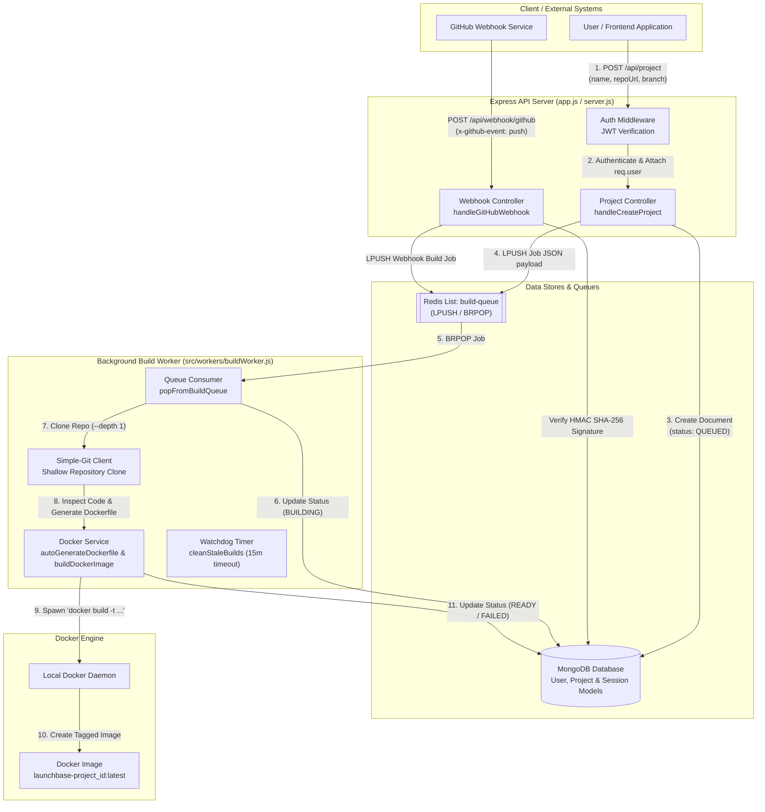
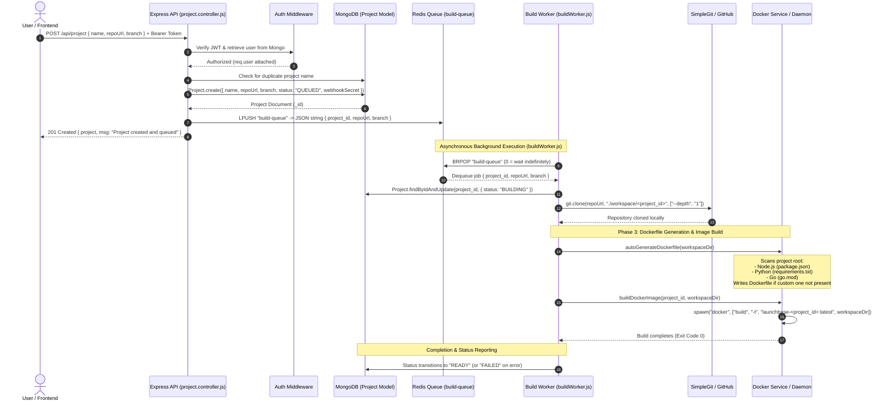
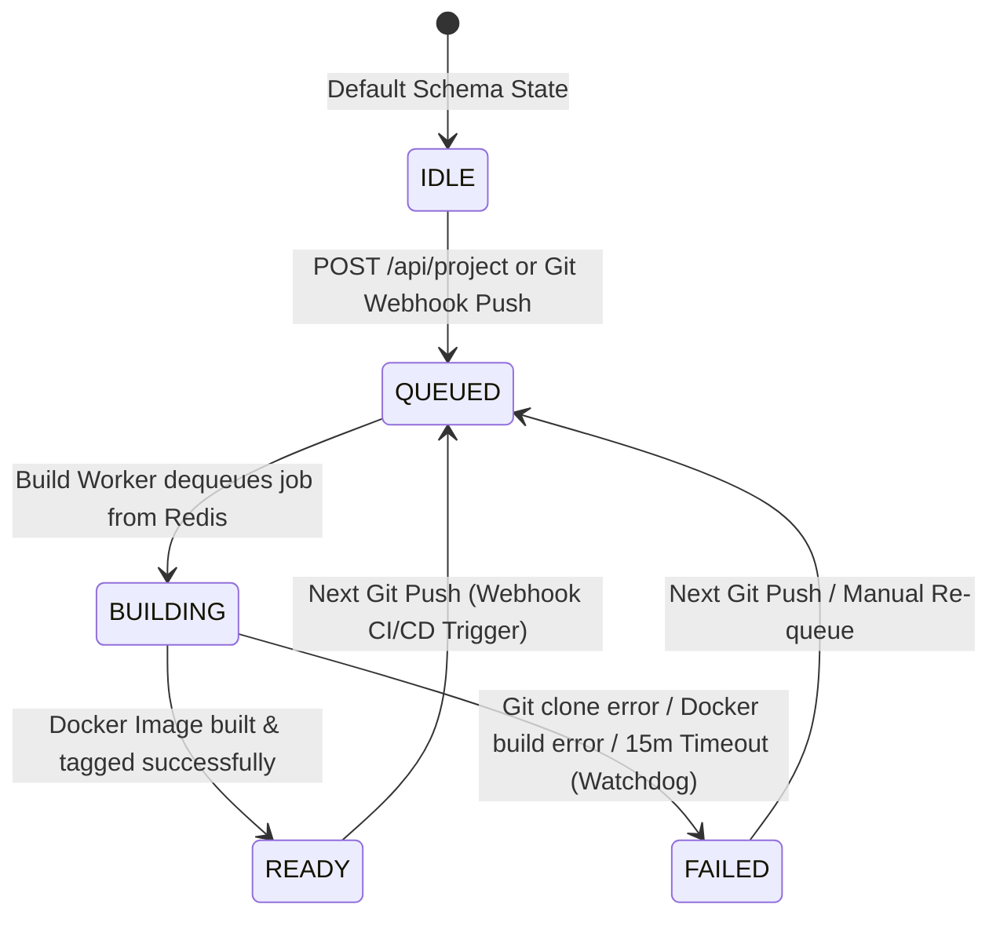

# LaunchBase Backend Architecture & Data Flow

This document provides an end-to-end architectural breakdown and visual data-flow guide for the backend (`backend/src`). It details how all components connect and traces exactly what happens from the moment a user creates a project to when a Docker image is built and tagged.

---

## 1. High-Level System Architecture

The backend consists of two primary runtime processes communicating asynchronously through **Redis** and **MongoDB**:
1. **Express API Server** (`npm start` / [server.js](file:///Users/zaidkhan/Developer/Web%20Development/Vercel-Project/backend/server.js#L1-L10)): Handles authentication, project creation, CRUD endpoints, and GitHub webhook ingestion.
2. **Background Build Worker** (`npm run worker` / [buildWorker.js](file:///Users/zaidkhan/Developer/Web%20Development/Vercel-Project/backend/src/workers/buildWorker.js#L26-L84)): Consumes build jobs from Redis, clones Git repositories, generates Dockerfiles automatically, and builds local Docker images.



---

## 2. Step-by-Step Data Flow: What Happens After Project Creation?

When a user submits a new project via `POST /api/project`, the request triggers an asynchronous **Producer-Consumer** workflow across the API, MongoDB, Redis, and the Docker engine.



---

## 3. Project Lifecycle & State Transitions

A project document in MongoDB ([project.js](file:///Users/zaidkhan/Developer/Web%20Development/Vercel-Project/backend/src/models/project.js#L33-L37)) transitions through explicit lifecycle states:



---

## 4. Component Breakdown & Source Code Connections

### A. API Layer & Routing
- **Entry Point**: [server.js](file:///Users/zaidkhan/Developer/Web%20Development/Vercel-Project/backend/server.js#L1-L10) connects to MongoDB via [db.js](file:///Users/zaidkhan/Developer/Web%20Development/Vercel-Project/backend/src/config/db.js#L3-L11) and starts the Express server defined in [app.js](file:///Users/zaidkhan/Developer/Web%20Development/Vercel-Project/backend/src/app.js#L1-L27).
- **Authentication Middleware**: [auth.middleware.js](file:///Users/zaidkhan/Developer/Web%20Development/Vercel-Project/backend/src/middlewares/auth.middleware.js#L5-L20) validates Bearer JWT tokens against `config.JWT_SECRET` and attaches the user document to `req.user`.
- **Project Routes**: [project.routes.js](file:///Users/zaidkhan/Developer/Web%20Development/Vercel-Project/backend/src/routes/project.routes.js#L13-L16) maps CRUD operations (`POST /`, `GET /`, `GET /:project_id`, `DELETE /:project_id`) to [project.controller.js](file:///Users/zaidkhan/Developer/Web%20Development/Vercel-Project/backend/src/controllers/project.controller.js#L5-L45).

### B. Project Creation & Job Queueing
- **Database Model**: [project.js](file:///Users/zaidkhan/Developer/Web%20Development/Vercel-Project/backend/src/models/project.js#L3-L54) defines schema fields including unique `name`, `owner`, `repoUrl`, `branch`, a randomly generated 20-byte `webhookSecret`, and enum `status`.
- **Queue Service**: [queue.service.js](file:///Users/zaidkhan/Developer/Web%20Development/Vercel-Project/backend/src/services/queue.service.js#L6-L29) wraps `ioredis`:
  - `pushToBuildQueue(jobData)`: Serializes job payload to JSON and executes `LPUSH` on list `"build-queue"`.
  - `popFromBuildQueue()`: Blocks using `BRPOP` on `"build-queue"` until a job arrives.

### C. Background Build Worker (`buildWorker.js`)
- **Worker Loop**: [buildWorker.js](file:///Users/zaidkhan/Developer/Web%20Development/Vercel-Project/backend/src/workers/buildWorker.js#L26-L43) runs continuously, calling `popFromBuildQueue()`.
- **Zombie Build Watchdog**: `cleanStaleBuilds()` runs every 15 minutes, scanning MongoDB for any project stuck in `status: "BUILDING"` for over 15 minutes and marking it `"FAILED"`.
- **Job Processing (`processBuildJob`)**:
  1. Sets project status in MongoDB to `"BUILDING"`.
  2. Creates working directory at `workspace/<project_id>`.
  3. Uses `simple-git` to perform a shallow clone (`--depth 1`) of the target GitHub repository and branch.
  4. Calls Docker Service to generate a Dockerfile and build the image.

### D. Docker Automation Service (`docker.service.js`)
- **Auto-Dockerfile Generator**: [autoGenerateDockerfile](file:///Users/zaidkhan/Developer/Web%20Development/Vercel-Project/backend/src/services/docker.service.js#L47-L142) detects project language and generates a production-ready `Dockerfile` if one doesn't exist:
  - **Node.js**: Detects `package.json`, checks for `scripts.build`, and generates a multi-stage Alpine Node image.
  - **Python**: Detects `requirements.txt`, inspects `.py` files for entry point signatures (`if __name__ == '__main__':`, FastAPI, Flask), and creates a `python:3.12-slim` image.
  - **Go**: Detects `go.mod`, generates a two-stage Go builder -> Alpine minimal image.
- **Image Builder**: [buildDockerImage](file:///Users/zaidkhan/Developer/Web%20Development/Vercel-Project/backend/src/services/docker.service.js#L145-L175) spawns a child process running:
  ```bash
  docker build -t launchbase-<project_id>:latest <workspaceDir>
  ```
  It captures stdout/stderr streams and resolves when Docker returns exit code `0`.

### E. Webhook CI/CD Automation
- **GitHub Webhook Ingestion**: [webhook.controller.js](file:///Users/zaidkhan/Developer/Web%20Development/Vercel-Project/backend/src/controllers/webhook.controller.js#L3-L49) listens on `POST /api/webhook/github`.
- **HMAC Verification**: [webhook.service.js](file:///Users/zaidkhan/Developer/Web%20Development/Vercel-Project/backend/src/services/webhook.service.js#L5-L21) verifies the GitHub `X-Hub-Signature-256` header against the project's stored `webhookSecret` using `crypto.timingSafeEqual()`.
- **Automatic Rebuild**: When a valid `push` event is received, `processGithubPush` sets the project status back to `'QUEUED'` and pushes a new job payload to Redis, triggering an automatic rebuild in the worker.
